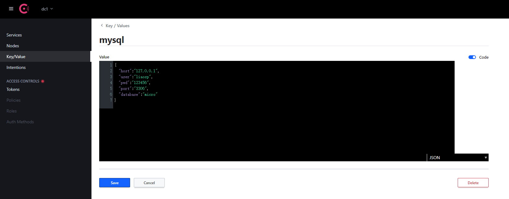
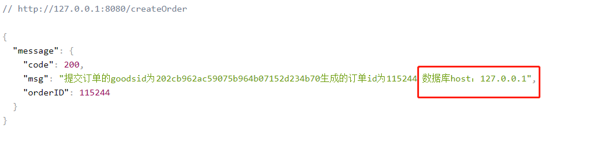

# 获取consul配置

使用 系统配置，有利于程序的维护，业务只管业务，服务配置统一管理。
比如数据库帐号密码，redis帐号密码，统一由Key-value 配置


>go get github.com/micro/go-plugins/config/source/consul/v2


新建 `common/common.go` 用户获取consul 中的配置key、value


```go
package common

import (
	"github.com/micro/go-micro/v2/config"
	"github.com/micro/go-plugins/config/source/consul/v2"
	"strconv"
)

func GetConsulConfig(host string ,port int64,prefix string)(config.Config,error)  {
	consulSource := consul.NewSource(
		consul.WithAddress(host+":"+strconv.FormatInt(port,10)),
		consul.WithPrefix(prefix),
		consul.StripPrefix(false),
	)

	config,err := config.NewConfig()

	if err != nil {
		return config,err
	}

	err = config.Load(consulSource);

	return config, err


}
```

比如我们项目中要使用到mysql的配置，我们定义一下mysql的结构

新建  ``common/mysql-config.go``

```go
package common

import "github.com/micro/go-micro/v2/config"

type MysqlConfig struct {
	Host     string `json:"host"`
	User     string `json:"user"`
	Pwd      string `json:"pwd"`
	Port     string `json:"port"`
	Database string `json:"database"`
}

//获取mysql 配置

func GetMysqlFromConsul(config config.Config, path ...string) *MysqlConfig {

	mysqlConfig := &MysqlConfig{}

	config.Get(path...).Scan(mysqlConfig);

	return mysqlConfig;

}

```

`GetMysqlFromConsul` 方法，获取配置中的参数，并且扫描进 `MysqlConfig`结构体


#### 服务调用

在服务端 `server.go`

添加一些代码：定义一个全局变量，并指向`MysqlConfig`结构
```go

var (
	MysqlConfig *common.MysqlConfig
)
```

在main 函数中获取consul配置,并赋值 `MysqlConfig`

```go
	consulConfig,err := common.GetConsulConfig("192.168.205.22",8500,"");

	if err != nil {
		fmt.Println(err)
		return
	}
	//获取配置中心数据
	MysqlConfig = common.GetMysqlFromConsul(consulConfig,"mysql");
```

这样获取到了信息之后 你就可以调用了


在CreateOrder 这个方法上修改

```go
rp.Msg = fmt.Sprintf("提交订单的goodsid为%s生成的订单id为%d 数据库host：%s", goodsId, generateOrderId,MysqlConfig.Host)
```

我们在consul添加刚刚结构体中的数据（如下图）

Json：
```json

{
  "host":"127.0.0.1",
  "user":"liaosp",
  "pwd":"123456",
  "port":"3306",
  "database":"micro"
}
```




客户端再请求,成功



```shell script
git add .
git commit -m "获取consul配置"
```


