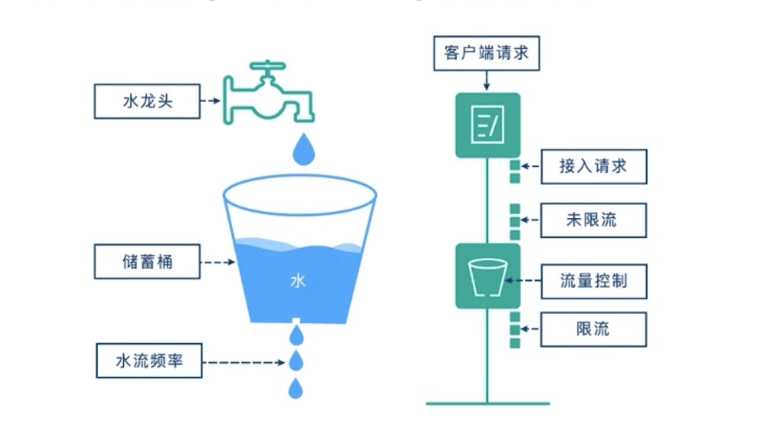

限流

>uber/limit

漏铜算法




获取

>go get github.com/micro/go-plugins/wrapper/ratelimiter/uber/v2


只需要在微服务中添加 ``micro.WrapHandler(ratelimit.NewHandlerWrapper(100)),`` 100 是QPS 根据业务员量进行调整

```go
	service := micro.NewService(
		micro.Name("order.service"),
		//注册中心
		micro.Registry(consulRegister),
		//绑定链路追踪
		micro.WrapHandler(opentracing2.NewHandlerWrapper(opentracing.GlobalTracer())),
		//限流
		micro.WrapHandler(ratelimit.NewHandlerWrapper(100)),
		
	)
```

这样就“白嫖”了一个漏桶算法了


