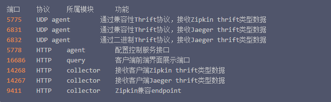

Jaeger安装
===========


>之前已经跑通了服务的注册和调用了，但是服务一多，无法定位到错误的位置，查找bug的时候没有头绪，所以微服务需要一个链路的追踪
>比如一条链路调用了用户中心，服务中心和

官方的库 docker 库：`jaegertracing/all-in-one`

>docker pull jaegertracing/all-in-one

#### 端口说明：




#### 运行
```shell script
docker run -d --name jaeger -p 6831:6831/udp -p 16686:16686 jaegertracing/all-in-one:latest
```

```shell script
git add .
git commit -m "Jeager 安装"
```

