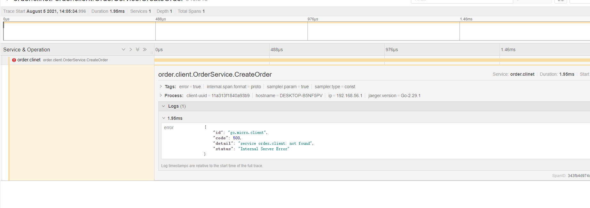

新建 ``common/jeager.go``

>go get github.com/opentracing/opentracing-go
 
客户端：

>go get github.com/uber/jaeger-client-go


微服务绑定链路

>go get github.com/micro/go-plugins/wrapper/trace/opentracing/v2


在main中添加链路追踪的数据
```golang
//链路追踪
	t,io,err := common.NewTracer("order.service","192.168.205.22:6831")

	if err !=nil {
		log.Fatal(err)
	}

	defer io.Close()

	opentracing.SetGlobalTracer(t)


	service := micro.NewService(
		micro.Name("order.service"),
		micro.Registry(consulRegister),
		//绑定链路追踪
		micro.WrapHandler(opentracing2.NewHandlerWrapper(opentracing.GlobalTracer())),
	)
```

client 端：

```
	//创建一个新的服务
	server := micro.NewService(
		micro.Name("client"),
		micro.Registry(consulRegister),
		//绑定链路追踪
		micro.WrapClient(opentracing2.NewClientWrapper(opentracing.GlobalTracer())),
	)
```

进入jaeger 



可以查看错误日志，还有相应的时间，有利于查找bug