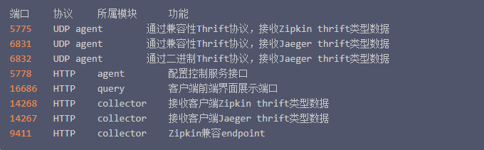

Jeager安装
===========

官方的库 docker 库：`jaegertracing/all-in-one`

>docker pull jaegertracing/all-in-one

#### 端口说明：




#### 运行
```shell script
docker run -d --name jeager -p 6831:6831/udp -p 16686:16686 jaegertracing/all-in-one:latest
```

```shell script
git add .
git commit -m "Jeager 安装"
```

